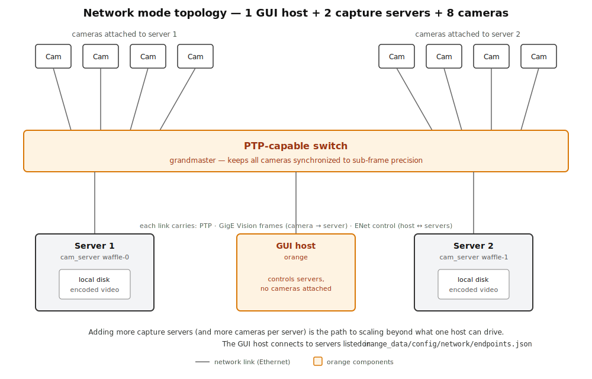

# orange capture 🎥

A high-performance, GPU-accelerated multi-camera capture, streaming and recording application for Emergent GigE Vision cameras, built in C++.


## Overview

`orange` is built for high-throughput, time-synchronized multi-camera recording. Encoding is GPU-accelerated and scales with the number of GPUs in the host. PTP keeps cameras aligned to sub-frame precision, and a multi-host architecture (one GUI host coordinating any number of headless `cam_server` nodes over ENet) lets a recording rig scale beyond what a single machine can drive — both in camera count and aggregate pixel rate. Optional TensorRT-based YOLO detection runs on the live streams when a model is provided.

## Video demo

Please see this [link](https://youtu.be/ahceluqBYj8) for a video demo of the app.

## Features

1. Multiple cameras streaming
2. PTP synchronization
3. GPU accelerated encoding (h264, hevc)
4. Support mono and color Emergent cameras
5. Multi-host capture (one GUI host coordinating several headless `cam_server` nodes)

## System requirements

`orange` is Linux-only and has been tested on NVIDIA GPUs with compute capability **7.5 (Turing)** and **8.0 (Ampere)**. The CMake build produces a fatbin for both architectures by default. To target a different one, pass `-DCMAKE_CUDA_ARCHITECTURES=<code>` at configure time (e.g. `86` for RTX 30-series, `89` for Ada Lovelace, `90` for Hopper).

The following stack is the one shipped on the [Clonezilla image](docs/clonezilla_image.md) and is the reference configuration for `orange`:

| Component       | Version          |
| --------------- | ---------------- |
| Ubuntu          | 22.04.4          |
| Linux kernel    | 6.5.0-44-generic |
| NVIDIA driver   | 535.183.06       |
| Emergent eSDK   | 2.55.02          |
| CUDA            | 12.2             |
| FFmpeg          | 4.4              |
| OpenCV          | 4.10             |
| TensorRT        | 10.0.1.6         |

Notes:

- **NVENC required.** Video encoding is done on the GPU via NVIDIA NVENC, so the GPU must support it. Most consumer/workstation NVIDIA GPUs do (RTX series, A6000, etc.); some datacenter compute parts (e.g. A100) have limited or no NVENC. Check NVIDIA's [Video Encode and Decode GPU Support Matrix](https://developer.nvidia.com/video-encode-and-decode-gpu-support-matrix-new) before buying hardware.
- **Kernel pinned to 6.5.** As of writing, the Emergent eSDK does not support kernel 6.8. Disable network access during Ubuntu install to prevent an automatic upgrade — see [`docs/install_linux_cuda_eSDK.md`](docs/install_linux_cuda_eSDK.md).
- **BIOS settings.** Enable **PCIE Above 4G Decoding** and **Resizable Bar**. You may need to update your BIOS if these options aren't present.

## Dependencies

1. Emergent SDK
2. CUDA Toolkit
3. FFmpeg
4. OpenCV
5. OpenGL and GLEW
6. TensorRT
7. ENET
8. Dear ImGui, ImPlot, ImGuiFileDialog, IconFontCppHeaders, FlatBuffers — bundled as git submodules under `third_party/`, fetched automatically with `git clone --recursive` (no separate install needed)

## Build instructions

> If you wish to skip the build process, an Ubuntu image is available with preinstalled `orange` and the labeling app `red`. Please contact the developer for accessing the image and follow instructions [here](docs/clonezilla_image.md).

1. **Clone the repo and submodules.**

   ```bash
   git clone --recursive https://github.com/moments-behavior/orange.git
   ```

2. **Install CUDA and the Emergent camera SDK.**
   The reference stack uses CUDA 12.2. Follow instructions in [`docs/install_linux_cuda_eSDK.md`](docs/install_linux_cuda_eSDK.md). Make sure you can stream all cameras individually with Emergent `eCapture`.

3. **Install FFmpeg 4.4.**
   Refer to [`docs/install_ffmpeg.md`](docs/install_ffmpeg.md) for detailed instructions for building FFmpeg 4.4.

   [`CMakeLists.txt`](CMakeLists.txt) assumes FFmpeg is installed at `$HOME/nvidia/ffmpeg` (`set(DIR_FFMPEG $ENV{HOME}/nvidia/ffmpeg)`). If you installed it elsewhere, edit `DIR_FFMPEG` to match your install directory.

4. **Install OpenGL and GLEW.**

   ```bash
   sudo apt-get install libglfw3
   sudo apt-get install libglfw3-dev
   sudo apt-get install libglew-dev
   ```

5. **Install OpenCV.**
   Refer to [`docs/install_opencv.md`](docs/install_opencv.md) for detailed instructions for building OpenCV.

6. **Install TensorRT.**
   Follow instructions in [`docs/install_tensorrt.md`](docs/install_tensorrt.md). [`CMakeLists.txt`](CMakeLists.txt) assumes TensorRT is installed at `$HOME/nvidia/TensorRT` (`set(DIR_TENSORRT $ENV{HOME}/nvidia/TensorRT)`). If you installed it elsewhere, edit `DIR_TENSORRT` to match your install directory.

7. **Install ENET.**
   Follow instructions at <http://enet.bespin.org/Installation.html>. You might need to run `sudo ldconfig` after installation, or simply reboot.

8. **Build the project.**

   ```bash
   ./build.sh
   ```

   This runs CMake into a `release/` directory and produces three executables by default:

   - `release/orange` — the GUI host app
   - `release/cam_server` — the headless networked camera node
   - `release/yolo_offline` — standalone offline YOLOv8 inference tool

   You can disable any target by passing `-DBUILD_ORANGE=OFF`, `-DBUILD_CAM_SERVER=OFF`, or `-DBUILD_YOLO_OFFLINE=OFF` to CMake. For example, [`server_build.sh`](server_build.sh) builds only `cam_server`.

   Start the GUI app with:

   ```bash
   ./run.sh
   ```

   On a headless server node, use [`start_server.sh`](start_server.sh) instead, which auto-detects the hostname and runs `cam_server` with it.

   Both scripts run with `sudo` because Emergent GigE Vision cameras and PTP need raw socket access.

9. **(Optional) Install a desktop launcher.**

   ```bash
   ./install.sh                # installs to $HOME/.local by default
   ./install.sh /opt           # or pass a custom prefix
   ```

   This copies the binary, fonts, and icon under `$PREFIX/opt/orange`, drops a wrapper at `$PREFIX/bin/orange`, and creates a `.desktop` entry. Use `./uninstall.sh` to remove.

## Performance

Encoding performance using a **single** A6000 GPU with a 7MP Emergent camera:


`orange` distributes per-camera encoding across GPUs (assigned by `gpu_id` in each camera's config), so total throughput scales with the number of GPUs in the host — adding GPUs is the recommended path to more cameras or higher resolutions.

## Usage

When first opened, `orange` creates folders with the following structure:

```
orange_data
├── calib_yaml
├── config
│   ├── local
│   └── network
├── detect       # TensorRT engine files for real-time detection (see below)
├── exp
│   ├── calibration
│   └── unsorted # default save location for recordings
└── pictures     # camera-frame snapshots
```

There are two modes of using the application: **local** vs **network**. Local means all cameras are connected to one server, while network can support multiple servers.

### User config (optional)

A few defaults can be overridden by creating `~/.config/orange/config.json`:

```json
{
  "recording_folder": "/mnt/data/orange_recordings"
}
```

Recognized keys:

- `recording_folder` — moves the recordings root (`exp/unsorted`, `exp/calibration`) out of `orange_data/` and onto a different disk. The rest of `orange_data/` (configs, calibration files, snapshots) stays where it is.
- `codec` — default encoder. Either `h264` (the default) or `hevc`.

### Local mode

You can save preconfigured camera settings under `local`, organized into **config presets** — named subfolders, each containing the cameras you want to load together. For instance:

```
orange_data
├── config
│   ├── local
│   │   ├── 5cam
│   │   │   ├── 2002488.json
│   │   │   ├── 2002489.json
│   │   │   ├── 2002490.json
│   │   │   ├── 2002496.json
│   │   │   └── 710038.json
│   │   └── center_ceiling
│   │       └── 710038.json
│   └── network
├── exp
│   └── unsorted
│       └── 2024_10_31_13_09_41
│           ├── Cam710038_meta.csv
│           └── Cam710038.mp4
└── pictures
    └── 710038_0.tiff
```

Above, `5cam` and `center_ceiling` are two config presets. Each contains one JSON file per camera, named after the camera serial number (e.g. `2002488.json`); the GUI lets you pick a preset to load that set of cameras. See [`config/2002496.json.example`](config/2002496.json.example) for an example. Key fields include `width` / `height`, `frame_rate`, `pixel_format`, `gain` / `exposure` / `iris` / `focus`, `color` (mono vs color), `color_temp` (e.g. `CT_3000K`), `gpu_id` (which GPU handles image processing for this camera), and `gpu_direct` (set `true` to enable GPUDirect RDMA from the NIC).

### Network mode



For multi-host capture, the GUI host runs `orange` and each capture host runs `release/cam_server <hostname>` (or [`start_server.sh`](start_server.sh) on hosts whose names match `waffle-N`). Communication is over ENet using a FlatBuffers control protocol (schema in [`schema/ctrl.fbs`](schema/ctrl.fbs)).

**Important caveats**

- **All `cam_server` processes must be running before the GUI is launched.** The GUI connects to its configured endpoints at startup, not on demand.
- The config preset folder (e.g. `config/network/8cam_rig/`) must exist on **both the GUI host and every capture host**. The contents can be identical across all hosts — each `cam_server` will only open the cameras that are physically attached to *its* host and silently ignore the rest. Copying the same complete preset folder to every machine is the simplest setup.

**Setup walkthrough**

1. On the GUI host, create `orange_data/config/network/endpoints.json` listing the capture hosts. A template is shipped at [`config/network/endpoints.json.example`](config/network/endpoints.json.example):

   ```json
   {
     "default_port": 34001,
     "servers": [
       { "name": "waffle-0", "host": "192.168.20.60" },
       { "name": "waffle-1", "host": "192.168.20.61" }
     ]
   }
   ```

   - `host` accepts a hostname or an IP.
   - `port` can be set per server; otherwise `default_port` is used.
   - `name` is the logical id (matches the argv `cam_server` is started with).

   The file is only needed for network mode. If it's absent, `orange` starts up normally and network features are unavailable; if it's present but malformed, `orange` prints a warning and continues.

2. On every host (GUI host + capture hosts), create a matching `orange_data/config/network/<preset>/` folder containing one JSON per camera in the rig (named after the camera serial). The folder can be identical across hosts.

3. On each capture host, start `cam_server`:

   ```bash
   sudo release/cam_server <hostname>      # or: ./start_server.sh
   ```

4. On the GUI host, launch `orange`:

   ```bash
   ./run.sh
   ```

   It reads `endpoints.json`, connects to each server, pushes the chosen preset name, and each server opens its locally-attached cameras from its copy of the preset.

Recordings are saved under `orange_data/exp/unsorted/<timestamp>/` by default; the save location can be changed from within the app.

### Real-time detection (optional)

`orange` can run a TensorRT-compiled YOLOv8 model in real time on the camera streams. The application looks for compiled engine files under `orange_data/detect/`. Make sure each camera's `gpu_id` in its config JSON matches the GPU the engine was compiled for.

See [`docs/YOLO.md`](docs/YOLO.md) for the full workflow: labeling a dataset from your recordings, training a YOLOv8 model, exporting to ONNX, and compiling to a TensorRT engine.

### PTP setting

PTP is required for sub-frame synchronization across cameras. Two setups are supported:

- **Host-only**, using `linuxptp` to sync NIC ports on a single host (cameras attached directly to a NIC).
- **Switched**, using a PTP-capable switch (Arista and Mellanox/Onyx examples included).

See [`docs/ptp.md`](docs/ptp.md) for detailed configuration steps.

## Authors

**Orange** is developed by Jinyao Yan, with contributions from Diptodip Deb, Wilson Chen, Ratan Othayoth, Jeremy Delahanty, and Rob Johnson.

Contact [Jinyao Yan](mailto:yanj11@janelia.hhmi.org) with questions about the software.

## Citation

If you use **Orange**, please cite the software:

```bibtex
@software{moments_behavior_orange_2026,
  author       = {Yan, Jinyao and
                  Deb, Diptodip and
                  Chen, Wilson and
                  Othayoth, Ratan and
                  Delahanty, Jeremy and
                  Johnson, Rob},
  title        = {moments-behavior/orange: v2.1.0},
  month        = apr,
  year         = 2026,
  publisher    = {Zenodo},
  version      = {v2.1.0},
  doi          = {10.5281/zenodo.19688150},
  url          = {https://doi.org/10.5281/zenodo.19688150},
}
```

## Contribute

Please open an issue for bug fixes or feature requests. If you wish to make changes to the source code, you can fork the repo and open a [pull request](https://docs.github.com/en/pull-requests/collaborating-with-pull-requests/proposing-changes-to-your-work-with-pull-requests/creating-a-pull-request).
