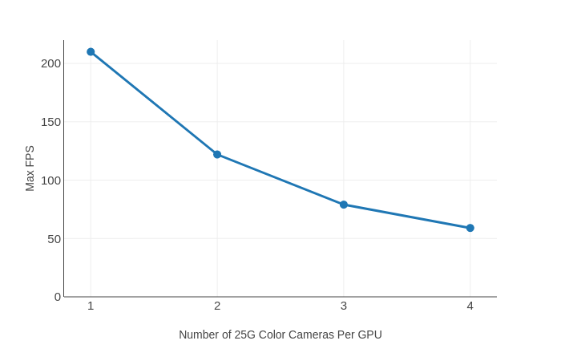

# orange :orange: 
A GUI-based C/C++ library for emergent cameras


## Features 
1. Multiple cameras streaming 
2. PTP synchronization 
3. GPU accelerated encoding (h264, h265)
3. Support 7MP, 65MP, 100G, mono or color Emergent cameras

## Benchmark
Encoding performance using GPU A6000 with 7MP Emergent camera



Run `build.sh` in local folder


## Build instructions 
1. Install Emergent camera SDK
2. Install FFmpeg as shared library
```
./configure --prefix=$(pwd)/build --disable-static --enable-shared --enable-nonfree --enable-cuda-nvcc --enable-libnpp --extra-cflags=-I/usr/local/cuda/include --extra-ldflags=-L/usr/local/cuda/lib64
```

3. Install OpenGL and GLEW, GLM
```
sudo apt-get install libglfw3
sudo apt-get install libglfw3-dev
sudo apt-get install libglew-dev
sudo apt-get install libglm-dev
```
