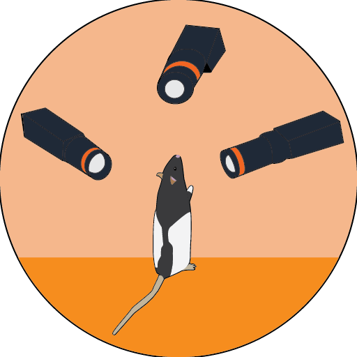

#  orange capture

A high-performance, GPU-accelerated multi-camera capture, streaming and recording application for [Emergent Vision](https://emergentvisiontec.com/) GigE cameras.


## Overview

`orange` is built for high-throughput, time-synchronized multi-camera recording on a single host. Encoding is GPU-accelerated (NVENC) and scales with the number of GPUs in the machine. PTP keeps cameras aligned to sub-frame precision. Each camera's H.264/HEVC stream is muxed to its own `.mp4` alongside a sidecar CSV of per-frame PTP and host timestamps for later alignment.

This is the minimal recording build: a single GUI executable, with no real-time inference and no OpenCV dependency. The pipeline is camera (Emergent eSDK) → CUDA/NPP debayer → NVENC encode → FFmpeg mux. Live preview is rendered with OpenGL/ImGui; still-image snapshots are written with `stb_image_write`.

## Documentation

Full documentation — installation, system requirements, configuration, PTP — lives at the [moments-behavior docs site](https://moments-behavior.github.io/docs/orange/).

[Video demo](https://youtu.be/ahceluqBYj8)

## Quick build

Linux-only. Requires an NVIDIA GPU with NVENC. See the docs for full system requirements and the dependency install walkthrough.

```bash
git clone --recursive https://github.com/moments-behavior/orange.git
cd orange
./build.sh    # builds release/orange
./run.sh      # sudo release/orange
```

### Dependencies

The minimal build requires: CUDA toolkit (with NPP + NVENC), the Emergent eSDK (`/opt/EVT/eSDK`), FFmpeg (used only for `.mp4` muxing), and the GUI stack (GLFW, GLEW, OpenGL). ImGui/ImPlot/ImGuiFileDialog/IconFontCppHeaders are vendored as git submodules. There is no OpenCV, TensorRT, ENet, or FlatBuffers dependency.

## Authors

**Orange** is developed by Jinyao Yan, with contributions from Diptodip Deb, Wilson Chen, Ratan Othayoth, Jeremy Delahanty, and Rob Johnson.

Contact [Jinyao Yan](mailto:yanj11@janelia.hhmi.org) with questions about the software.

## Citation

If you use **Orange**, please cite the software:

```bibtex
@software{moments_behavior_orange_2026,
  author       = {Yan, Jinyao and
                  Deb, Diptodip and
                  Chen, Wilson and
                  Othayoth, Ratan and
                  Delahanty, Jeremy and
                  Johnson, Rob},
  title        = {moments-behavior/orange: v2.1.0},
  month        = apr,
  year         = 2026,
  publisher    = {Zenodo},
  version      = {v2.1.0},
  doi          = {10.5281/zenodo.19688150},
  url          = {https://doi.org/10.5281/zenodo.19688150},
}
```

## Contribute

Please open an issue for bug fixes or feature requests. If you wish to make changes to the source code, fork the repo and open a [pull request](https://docs.github.com/en/pull-requests/collaborating-with-pull-requests/proposing-changes-to-your-work-with-pull-requests/creating-a-pull-request).
