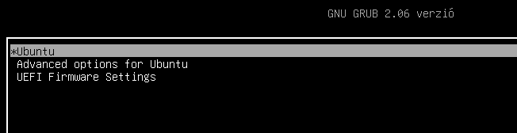
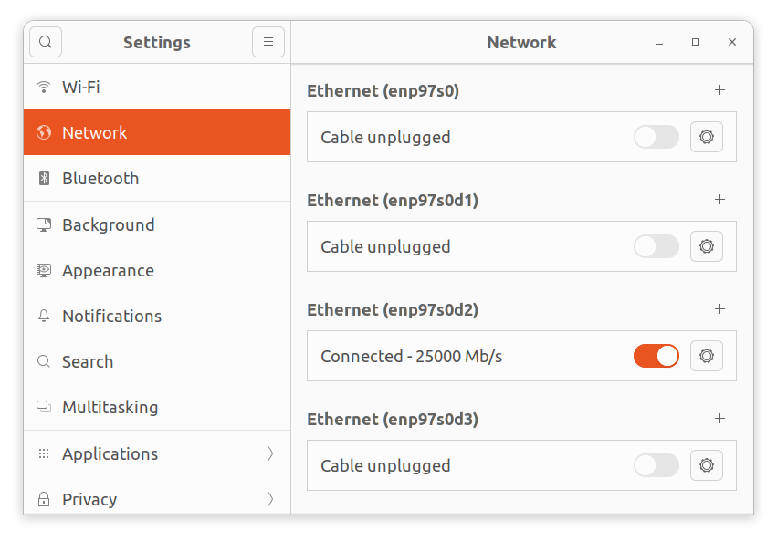
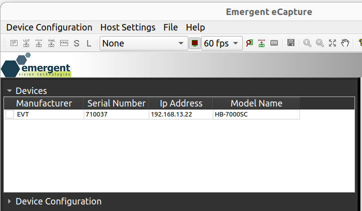
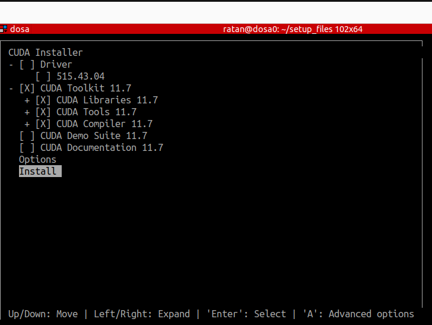

## setting up linux PCs 

here is the overview of the steps -- detailed instructions for each are in the sections below.

- [intial setup to install linux ](#initial-set-up-before-installing-linux)
- [installing linux](#install-linux)
- [post installation -- change grub configuration](#post-installation----change-grub-configuration)
- [update and install some useful software](#update-and-install-some-useful-software)
- [emergent SDK and dependencies ](#install-emergent-sdk-and-dependencies)
- [NVIDIA driver ](#install-nvidia-driver)
- [cuda (depends on nvidia driver)](#install-cuda-depends-on-nvidia-driver-installation)

-----------------------------------------------------------------------------------------------------------
### initial set-up before installing linux

0. create a [bootable linux USB](https://ubuntu.com/tutorials/create-a-usb-stick-on-ubuntu#1-overview) for an [ubuntu 22.04.4 ISO](https://old-releases.ubuntu.com/releases/22.04/): `ubuntu-22.04.4-desktop-amd64.iso`. The default kernel is 6.5. 
	- alternatively, you can use [balenaEtcher](https://etcher.balena.io/) to make a bootable linux USB
1. ensure the following on PC:
    - an existing video card that displays existing OS or BIOS screen on a monitor -- no need to worry about graphics driver for now
    - at least 3 USB ports that work when you enter BIOS/installation  (mice/keyboard/linux USB) 
    - <em>Important:</em> disable any wired/wireless network connections during the install, otherwise it will automatically upgrade to kernel 6.8. As the date of written, emergent eSDK only supports up to kernel 6.5. 
2. plug the bootable linux USB into one of the active ports and boot up the PC.
3. if the PC does not directly boot into the linux USB, you may have to change the `Boot settings` in  BIOS to boot from the linux USB
	- enter BIOS by pressing F2 or DEL (unlikely, but it could be a different key for some motherboards)
	- go into BOOT menu in BIOS and set to to boot from the linux USB (disable all other boot options)
	- save BOOT settings and reboot

<details>
<summary>possible issues you may encounter (click to expand):</summary>

1. keyboard/mice not working -- not all USB ports in the PC may work during installation -- identify which USB ports are active in the PC by plugging the mouse/keyboard into different ports

2. screen does not boot into linux USB -- you might want to reformat the USB and create the linux USB stick again or even use a different USB stick -- this has happened sometimes
</details>

-----------------------------------------------------------------------------------------------------------

### install linux

0. wait till a ubuntu desktop is visible and go step-by-step, choosing the following options
1. `Install Ubuntu`
2. choose keyboard layout, time zones, etc
3. under `Updates and other software` -- choose only `Minimal Installation` 
4. under `Installation type`  -- choose `Erase Disk and Install Ubuntu`
5. choose default disk/partition to install ubuntu 
6. setup user accounts -- do not run software upgrade that will be prompted towards the end of install.
7. once the installation is complete and you log in, open a terminal `Ctrl + Alt + T` and check the what versions of Ubuntu and linux kernel
    ```
    lsb_release -a
    uname -r
    ```

   Output should be:
   ```
   Distributor ID:	Ubuntu
   Description:	Ubuntu 22.04.4 LTS
   Release:	22.04
   Codename:	jammy
   ```
   ```
   6.5.0-18-generic
   ``` 
-----------------------------------------------------------------------------------------------------------

### post installation -- change grub configuration

  0. this step is needed to boot into secure mode to install NVIDIA drivers and also detect multiple GPUs
  1. open and edit the grub menu file (`/etc/default/grub`)
      ``` 
      sudo gedit /etc/default/grub
      ```
  2.  set the following options to as below (lines that begins with `#` are comments-- keep/remove as needed):
      ```
      # show the menu
      GRUB_TIMEOUT_STYLE=menu
      # set time out for the menu
      GRUB_TIMEOUT=5
      # pci=realloc=off is needed for adding two graphics cards -- there maybe other arguments in the following variable -- that case, keep them
      GRUB_CMDLINE_LINUX_DEFAULT="quiet splash pci=realloc=off"
      ```

  3. save the file and update grub with the above changes
      ```
      sudo update-grub
      ```
4. reboot and see if you are able to enter the splash screen -- 
    <details> 
      <summary> expected output -- click to expand </summary>
            
    </details>

-----------------------------------------------------------------------------------------------------------

### update and install some useful software

  0. disable automatic updates and upgrades (details TODO) and only **then** connect to ethernet 
  1. run an update
      ```
      sudo apt-get update
      ``` 
  2. install some required packages (TODO -- add a more comprehensive list)
      ```
      sudo apt-get install net-tools pkg-config make gcc libglvnd-dev git 
      ```
  3. setup ssh client and server
      ```
      sudo apt-get install openssh-client openssh-server
      sudo systemctl enable ssh
      sudo ufw allow ssh
      ```
  5. (optional) setup `grub-customizer` to show only the required kernel if you end up with multiple kernels
  6. let's also make following directories for convenience
      - `/home/$USER/setup_files` -- we will download drivers, installation files, etc to here
      - `/home/$USER/nvidia` -- we will build all dependencies to here
      - `/home/$USER/src` -- we will clone source codes/repos to here
-----------------------------------------------------------------------------------------------------------

### install emergent SDK and dependencies

**0. ensure that emergent quad port nic is plugged in to the the PCIe slot**

**1. download files from emergent ftp server** 
- I've note the versions that have currently worked for us
- eSDK: [eSDK 2.55.02 Linux Ubuntu 22.04 Kernel 6.5.0](https://emergentvisiontec.com/esdk/)
- (optional) -- rivermax license file: (`rivermax.lic`)


**2. unzip and install the eSDK** 
- the instructions assume that the files above have been downloaded/moved to `/home/$USER/setup_files`
    ```
    cd /home/$USER/setup_files
    unzip eSDK_2_51_01_eCap_2_11_02_Ubuntu_22_04_6_5_0_x64.zip -d eSDK_2_51_01
    cd eSDK_2_51_01
    sudo ./install_eSdk.sh -i EVT
    ```
-  the install script will download and install necessary dependencies and the driver for emergent quad port NIC
- if it ran successfully, you will see the following once the commands have run.

    ```
    Installing dependency drivers...

    Installing EVT NIC device driver...
    Building EVT NIC driver. Log file: /tmp/evt_nic_log.8jYtsgjy1
    EVT NIC driver was built successfully.

    Emergent eSDK & eCapture have been installed successfully.
    ```

**3. (optional for phields team, I think) --  copy the license file to `/opt/mellanox`**
    ```
    cd /home/$USER/setup_files
    sudo cp rivermax.lic /opt/mellanox
    ```

**4. launch `ecapture`** 
- if the eSDK and drivers have been installed, you should be able to launch `eCapture` 
- we have not configured NIC yet -- so we may not be able to stream/acquire images
    ```
    cd /opt/EVT/eCapture
    sudo ./eCapture
    ```

**5. configure network settings for the NIC**.
  - under `Settings > Network`, you should be able to see four similarly named EVT NIC interfaces (`enp97s0` and `enp97s0dX`)
     <details> 
      <summary> <i>screenshot -- click to expand</i> </summary>
            
    </details>
  - in the image above, `enp97s0d2` shows as connected becaues I have a camera connected to that port
  - apply/verify the following network settings to each of the EVT NIC interfaces you want to use
  
      | property | value         |
      |----------|---------------|
      |   MTU    |  3000         |
      |   IPv4   |  Manual       |
      |  Address | 192.168.13.10 |
      |  Netmask | 255.255.255.0 |
      |Gateway   | 192.168.13.1  |
  - our convention is to keep each interface on a different subnet -- i.e, for the other three interfaces, the addresses can be `192.168.10.10`, `192.168.11.10`, and `192.168.12.10`


**6. configure cameras to stream through `eCapture` app**
  - connect camera to the EVT NIC port using a fiber optic cable and then power on
  - open eCapture app
    ```
    cd /opt/EVT/eCapture
    sudo ./eCapture
    ```
  - if the camera IP is configured properly, it should show up under `Devices` panel
    <details> 
      <summary> expected output -- click to expand </summary>
            
    </details>
  - if the camera does not show up under `Devices` panel, force an ip for camera from `Device Configuration --> Force ip` and enter the following details
      |     field| value         |
      |----------|---------------|
      | MAC/SN   | the serial number on the camera         |
      |   IP address   |  if the camera is plugged to the NIC port with ip `192.168.13.10`, the IP address of camera should be `192.168.13.XX` where `XX != 10`.        |
      |  Subnet | 255.255.255.0 |
      |Gateway   | 0.0.0.0  |
  - click `Apply` and wait for a couple of seconds -- the camera should show up under `Devices` 
  - **note** -- the above method just sets a temporary IP -- to set an IP configuration that persists after power cycling, use `Device Configuration --> IP Configuraiton`, set values under `Persistent IP Address` and then `Write Configuration`
  - test if the IP configuration persists by power cycling the camera and test if you can acquire frames
  
**7. update camera firmware to 3.70**
  - download the firmware from emergent FTP and move to `/home/$USER/setup_files` -- usually it has the following files
    - BIN file : `HB_IMX4xx_3.70.bin` (maybe different for your camera -- but it will be a `bin` file)
    - XML file : `XML_HB-7000S-C_3_70.zip`
  - follow the instructions in the included `Readme.txt` 

-----------------------------------------------------------------------------------------------------------


### install NVIDIA driver 

**0. Download the driver setup file**
- To download NVIDIA linux drivers, go to [this page](https://www.nvidia.com/en-us/drivers/unix/linux-amd64-display-archive/) and search for a particular version that you want.  
  - `525.105.17` seems to work well with A6000 GPU or a PC with both A16 and A6000. 
  - `550.90.07` also works well with multiple A16
  - TODO -- compile versions that work well
- click on the driver to download it, or you can download it to say, the `setup_file` folder using 
  ``` 
  cd /home/$USER/setup_files
  wget https://us.download.nvidia.com/XFree86/Linux-x86_64/525.105.17/NVIDIA-Linux-x86_64-525.105.17.run
  ```

**1. run the installation file**
- you can try running the downloaded installation file from a terminal in the Desktop environment, but in our experience it almost often fails or has issues (because the existing graphics driver is running?).
- it is highly recommended that you boot into the secure mode first and then run the installation file
  ```
  cd /home/$USER/setup_files
  chmod +x NVIDIA-Linux-x86_64-525.105.17.run 
  sudo ./NVIDIA-Linux-x86_64-525.105.17.run 
  ```
- in the prompts that appear, use the following options

  --> `Continue Installation`

  --> `Ok` for removing Nouveau

  --> `Yes` for creating modprobe file

  --> `No` for 32-bit compatability

- if you get an error message or installation fails, check the install log file:
  ```
  cat /var/log/nvidia-installer.log
  ```
**2. some common errors that we have run into and possible fixes**
  - **`gcc` version mismatch**: sometimes the installer maybe expecting a different version of `gcc` -- this would show up in the log file. In that case, install the necessary `gcc` version and run the nvidia-driver-install command by setting `CC` environment variable to the desired version. for example:
    ```
    sudo apt-get install gcc-12
    sudo CC="/usr/bin/gcc-12" ./NVIDIA-Linux-x86_64-525.105.17.run 
    ```

  - **missing dependencies/packages** : you maybe missing packages such as `pkg-config`, `libglvnd`, etc (usually these are mentioned in the error messages or in the log file). Install these packages and re-run the installer -- you may have to do this multiple times as the installer only checks for one package at a time
  
  
  - if you run into other errors and find a fix, we'd appreciate it if you can add to this section or open a pull request!
   

**3. check if the driver is installed properly**
  ```
  nvidia-smi    
  ```
  this should list the details of the GPUs that can be accessed using the driver
    
-----------------------------------------------------------------------------------------------------------


### install CUDA (depends on nvidia driver installation)
**0. download installation file**
- you can directly download the version we use (cuda `12.0` with driver `525.105.17`)
  ```
  cd /home/$USER/setup_files
  wget https://developer.download.nvidia.com/compute/cuda/12.0.0/local_installers/cuda_12.0.0_525.60.13_linux.run
  ```
- (optional/alternative) you can also download a different version from [this page](https://developer.nvidia.com/cuda-toolkit-archive) -- we find it better to use the `runfile (local)` type installer


**1. run the install file**
- command:
    ```
    cd /home/$USER/setup_files
    sudo cuda_12.0.0_525.60.13_linux.run
    ```
- make sure to :
  - uncheck `Driver` under the `CUDA Installer` menu -- we do not want to reinstall a different driver
  - check `CUDA Toolkit 12.X`
  - start installation using `Install` -- follow prompts as needed
  - <details> 
      <summary> install menu (cuda 11.7 shown) -- click to expand </summary>
            
    </details>
  - note the output at the end of the installation to see the path to which `cuda` has been installed to (usually `/usr/local/cuda`) -- it will also have instructions for the step below

**2. add to PATH and verify installation**
  - check installation output above to see what path is to be added -- then open `.bashrc`
    ```
    gedit /home/$USER/.bashrc
    ```
  - add cuda install path to `$PATH` variable -- should look something like this
    ```
    export PATH=/usr/local/cuda/bin:$PATH
    export LD_LIBRARY_PATH=/usr/local/cuda/lib64:$LD_LIBRARY_PATH
    ```
  - save changes to `.bashrc`, exit and verify installation 
    ```
    source ~/.bashrc
    nvcc --version
    ```
